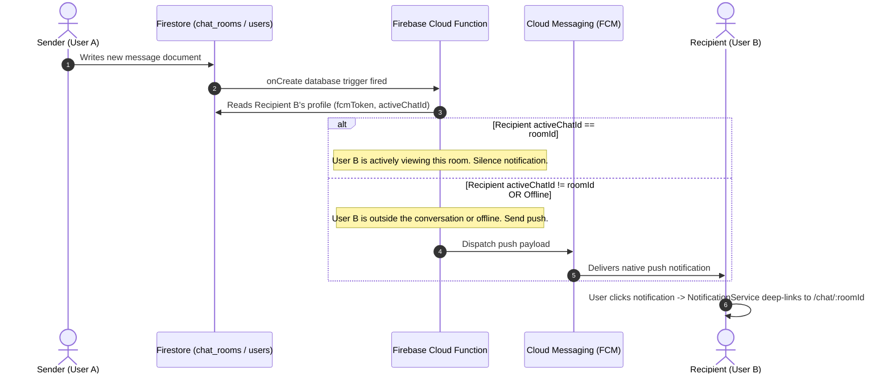

# ChatX – Production-Grade Real-Time Messaging Platform

ChatX is a startup-quality, cross-platform, real-time messaging application built with Flutter. It utilizes a clean Service-Oriented Architecture (SOA), Riverpod for state management, GoRouter for declarative routing, and Firebase (Auth, Firestore, FCM) for backend storage and notifications.

---

## 1. Architectural Architecture & Folder Design

The codebase implements a strict **separation of concerns** to decouple presentation layers from business logic and physical networking layers.

```
lib/
├── core/
│   ├── config/       # Global environments, options, and flags (Env, DefaultFirebaseOptions)
│   ├── routing/      # Routing stack definitions, route paths, and Auth guards (GoRouter)
│   └── utils/        # Shared modules (Logger utility)
├── models/           # Domain data mappings (UserModel, ChatRoomModel, MessageModel)
├── services/         # Client wrappers for network, Auth, and database interfaces
├── providers/        # Riverpod StateNotifiers, Controllers, and stream hooks
├── screens/          # Adaptive layout page components
├── widgets/          # Atomic UI elements (ChatXButton, ChatXTextField, MessageBubble)
└── theme/            # Stylistic configuration (AppTheme, BrandColors, Typography)
```

### Dependency Flow Direction
All components follow a unidirectional dependency flow:
* **Domain Models** (`models/`) are completely decoupled and immutable.
* **Services** (`services/`) depend only on external package dependencies (Firebase client instances) and domain models.
* **Providers** (`providers/`) inject services via Riverpod and expose streams and methods to the UI.
* **Screens & Widgets** (`screens/`, `widgets/`) watch provider state changes. No direct calls to Firebase are made in UI layers.

---

## 2. Push Notification Architecture

ChatX implements a **hybrid backend-driven** notification protocol. The client app synchronizes recipient context in real-time, while notification routing decisions are handled entirely in the cloud.



### Key Scenarios Handled
* **Active Chat View (No Notification)**: Recipient's `/users/{uid}` document tracks `activeChatId`. If it matches the message's `roomId`, the function silences the push notification to prevent redundant alerts.
* **App Terminated/Killed State**: When a user clicks a push notification from a terminated state, `getInitialMessage()` retrieves the payload. [NotificationService](file:///d:/Coding/Project/chatx_interview_task/lib/services/notification_service.dart) parses the data and triggers deep-linking.
* **Logout Cleanup**: Upon signing out, the client atomically clears `fcmToken` from Firestore before terminating the Firebase Auth session, ensuring no notifications are delivered to logged-out devices.

---

## 3. Spacing & Design System

The app enforces a clean spacing system and modern typography to achieve an elegant look:
* **Color Schemes**: Defaults to **Obsidian Dark Mode** (`#09090B` background with `#18181B` surfaces and `#6366F1` Indigo primary actions) and toggles to **Alabaster Light Mode**.
* **Layout Responsiveness**:
  * **Mobile (<600px)**: Single-pane view. Chat list navigates to a full-screen chat detail page.
  * **Tablet (600px - 1024px)**: 2-pane view. Left chat list (`320px`) and right chat details (expanded).
  * **Web/Desktop (>=1024px)**: 3-pane view. Sidebar navigation navigation (`72px`), chat list (`360px`), and chat detail pane.
* **High-Fidelity Grouping**: Adjacent message bubbles from the same user sent within a 5-minute interval are visually grouped (bubble tails are hidden, vertical padding is compressed to `2px`).

---

## 4. Setup & Firebase Provisioning Guide

### Prerequisites
* Flutter SDK (compatible with environment SDK `^3.11.4`)
* Node.js & npm (for deploying Cloud Functions)
* Firebase CLI installed (`npm install -g firebase-tools`)

### Firebase Console Setup
1. Create a Firebase project named **ChatX** on the [Firebase Console](https://console.firebase.google.com).
2. Enable the following services:
   * **Authentication**: Enable the *Email/Password* provider.
   * **Cloud Firestore**: Enable in *Test Mode* (or configure security rules below).
   * **Cloud Messaging**: Enable FCM.
3. Configure target platforms by adding Web, Android, and iOS apps in your Firebase console.

### Local Setup
1. Clone the repository and run:
   ```bash
   flutter pub get
   ```
2. Set up Firebase locally by running the Firebase configure script or updating configuration values in [firebase_options.dart](file:///d:/Coding/Project/chatx_interview_task/lib/core/config/firebase_options.dart).
3. To run code analysis and execute the test suite:
   ```bash
   flutter analyze
   flutter test
   ```
4. Run the application:
   ```bash
   flutter run
   ```

---

## 5. Deployment Guide

### Flutter Web Client
Build the production-optimized web bundle:
```bash
flutter build web --release --base-href "/"
```
* Deploy the contents of the `build/web` directory to hosting platforms (e.g. Firebase Hosting, Netlify, Vercel).

### Firebase Cloud Functions Setup
1. Log in to Firebase CLI:
   ```bash
   firebase login
   ```
2. Navigate into the `functions` directory:
   ```bash
   cd functions
   ```
3. Install Cloud Function dependencies:
   ```bash
   npm install
   ```
4. Deploy the database trigger function:
   ```bash
   firebase deploy --only functions
   ```

---

## 6. Interview Preparation & Technical Cheat Sheet

Here are common interview questions and technical topics to review for architecture walk-throughs:

### State Management: Why Riverpod?
* **Decoupled Business Logic**: Riverpod providers do not require a `BuildContext` to be read, which allows business logic classes like `AuthNotifier` to remain separated from Flutter UI code.
* **Auto-Disposal and Stream Management**: Stream providers naturally cancel their database subscriptions when UI screens are popped, which prevents network resource leaks.
* **Injectable Test Overrides**: As demonstrated in `test/widget_test.dart`, we can easily override Firebase service providers with mock instances without modifying app initialization code.

### Performance: Optimizing Database Reads & Rebuilds
* **Scroll Pagination**: To prevent loading thousands of messages, we query with `.limit(limit)` and descending timestamps. We reverse rendering using `reverse: true` inside [ChatDetailScreen](file:///d:/Coding/Project/chatx_interview_task/lib/screens/chat_detail_screen.dart). Scrolling up increments the load limit, loading history smoothly.
* **Rebuild Isolation via Selectors**: Instead of widgets watching the entire `AuthState` object, they use specific selectors like `currentUserProvider`. Rebuilds only trigger when the targeted property changes.

### Security Rules: Firestore Security Blueprint
Deploy these Firestore security rules to protect the user database and message streams:
```javascript
rules_version = '2';
service cloud.firestore {
  match /databases/{database}/documents {
    
    // User profile access: authenticated users can read profiles, but write only to their own document.
    match /users/{userId} {
      allow read: if request.auth != null;
      allow write: if request.auth != null && request.auth.uid == userId;
    }
    
    // Chat room rules: users can only read or write to rooms where they are listed as a participant.
    match /chat_rooms/{roomId} {
      allow read, write: if request.auth != null && request.auth.uid in resource.data.participantIds;
      allow create: if request.auth != null && request.auth.uid in request.resource.data.participantIds;
      
      // Messages collection inside room: inherit participant checks.
      match /messages/{messageId} {
        allow read, write: if request.auth != null && request.auth.uid in get(/databases/$(database)/documents/chat_rooms/$(roomId)).data.participantIds;
      }
    }
  }
}
```
